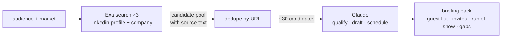

# field-agent

Field marketing for one person covering a continent. Give it an audience and a city; it returns a qualified guest list for an executive dinner, personalised invites, and a timed run of show — one command, one markdown briefing pack, built on [Exa](https://exa.ai) search.

```bash
python3 field_agent.py "platform engineering leaders" --market London
python3 field_agent.py "heads of AI at insurers" --market Munich
```

A London run found platform leads at Wise, Sky, Deliveroo, HSBC and Visa, wrote a why-this-seat line for each, drafted three invites against their actual profiles, and produced the run of show — for about two cents of Exa credit. [Read the sample brief](out/sample-brief-london.md).

## How it works



Three Exa searches build a candidate pool with citations and profile text. Claude qualifies it to the 8–10 strongest seats, writes each invite against that person's own profile, and generates a run of show that starts with the 4pm pre-checks. Every brief ends with a gaps section: what the research could not verify and what a human must check before anything sends.

## Setup

```bash
git clone https://github.com/b1rdmania/field-agent
cd field-agent
export EXA_API_KEY=your-key   # or put EXA_API_KEY=... in .env
python3 field_agent.py "your audience" --market YourCity
```

Requires Python 3, curl, and the [Claude Code CLI](https://claude.com/claude-code) on PATH. No other dependencies — the script is stdlib only.

## What it does

- Runs three Exa searches per market (linkedin-profile and company categories) and dedupes into a sourced candidate pool
- Qualifies hard: junk hits and wrong-seniority profiles are cut, each surviving seat gets a concrete why-this-seat line
- Drafts invites that reference the guest's own work — no mail-merge tone, no exclamation marks
- Writes a full run of show for a 12-seat dinner, from 4pm venue walkthrough to 9:45pm debrief
- Flags its own limits: role-currency, seniority calls, and consent checks a human owes the list before sending

## What it doesn't do

- Never contacts anyone — it produces a brief, not an outbound campaign
- Doesn't verify guests are still in the stated role; the gaps section tells you who to re-check
- Doesn't find email addresses, and isn't trying to

## Data handling

Research pulls public-source data with citations. Personal data stays out of version control: real run output is gitignored and the committed sample is redacted to roles and companies. The consent and verification checks live in every brief, next to the guest list they apply to.

## License

MIT
