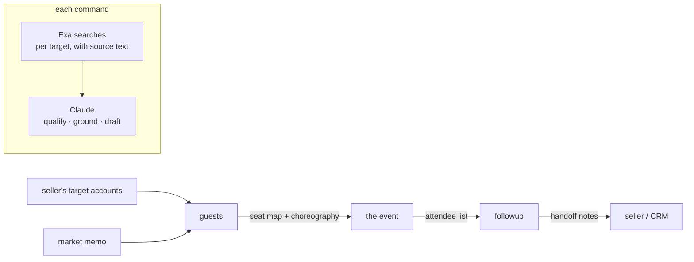

# field-agent

Field marketing for one person covering a continent. Four commands mirroring the field-marketing loop — market selection, account-based guest mapping, cold-start discovery, post-event follow-through — all built on [Exa](https://exa.ai) search. Each command is one line in, one markdown briefing pack out. Nothing ever sends.

| Command | In | Out |
|---|---|---|
| `market` | a buyer segment + candidate cities | ranked memo: where the next event goes, with a pipeline rationale |
| `guests` | a seller's target-account list | account briefs, seat map, in-deal choreography per account |
| `dinner` | an audience + a city (no account list yet) | discovery guest list, invites, run of show |
| `followup` | the attendee list after the event | prioritised follow-up queue, drafts, CRM handoff notes |

```bash
python3 field_agent.py market "AI platform buyers" --cities London,Paris,Munich,Amsterdam
python3 field_agent.py guests accounts.txt --market London
python3 field_agent.py dinner "platform engineering leaders" --market London
python3 field_agent.py followup attendees.txt --event "London infra dinner, 12 Aug"
```

The account-based mode is the one that matters: sellers name the accounts, the agent finds who at each account should be in the room and why now. A run against Revolut, Monzo and Checkout.com surfaced each account's live AI-infrastructure signal (a group ML lead's own conference framing, an in-house coding agent writing 18% of PRs), mapped the seats to those signals, and wrote the seating choreography for the seller — for a few cents of Exa credit. Samples: [guest map](out/sample-guest-map-london.md) · [cold-start dinner brief](out/sample-brief-london.md).

## How it works



Every command runs the same two stages: Exa searches per target (linkedin-profile, company and news categories) build a pool with citations and page text; Claude qualifies it hard, grounds every claim in the source text, and writes the pack. Every pack ends with a gaps section — what the research could not verify and what a human must check before anything moves.

## Setup

```bash
git clone https://github.com/b1rdmania/field-agent
cd field-agent
export EXA_API_KEY=your-key   # or put EXA_API_KEY=... in .env
python3 field_agent.py guests accounts.txt --market London
```

Requires Python 3, curl, and the [Claude Code CLI](https://claude.com/claude-code) on PATH. No other dependencies — one file, stdlib only.

## What it does

- Ranks candidate cities for a segment on buyer density and event-landscape evidence, and says what would change the call
- Maps a target-account list to seats: who at each account, why that person, why now — grounded in the account's own blogs, talks and announcements
- Writes in-deal choreography for the seller: the seating and conversation move that turns dinner into a next meeting
- Drafts invites and follow-ups against each person's own work — no mail-merge tone, no exclamation marks
- Flags its own limits every time: role currency, existing relationships, procurement collisions, consent

## What it doesn't do

- Never contacts anyone — every pack is a brief for a human, not an outbound campaign
- Doesn't read your CRM; the gaps section tells you what to check with the account owner instead
- Doesn't find email addresses, and isn't trying to

## Data handling

Research pulls public-source data with citations. Personal data stays out of version control: real run output is gitignored, committed samples are redacted to roles and companies. Follow-up packs include the lawful-basis note for contacting event attendees, and the consent checks sit next to the lists they apply to.

## License

MIT
