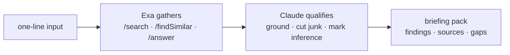

# field-agent

Field-marketing research, run by agents on [Exa](https://exa.ai) search. One line in, one sourced briefing pack out. Nothing ever sends.

## The demos

**Where does an EMEA base sit, and which market gets event investment first?** One command ranked London, Paris, Amsterdam and Munich on buyer density, anchor calendar and local event norms → **[the market memo](out/sample-market-emea.md)**. The evidence points at London as the base and the first events market — and the memo says why, what format fits each city, and what would change the call.

**What does the competitive landscape look like this quarter?** Run against Exa itself, on Exa's own API → **[the landscape](out/sample-competitors-exa.md)**. Direct rivals split from noise, dated moves with a "so what" each — a rival's benchmark-and-price attack, an acquisition that narrows the field — positioning read, white space, and the claims that still need primary sourcing flagged as such.

**Which accounts look like our best two?** Two fintech seeds in → [tiered lookalike accounts](out/sample-expand-emea.md) out: Starling, Revolut, Swan, Aevi — with shrinking shells disqualified by name.

**Who sits where, and why?** [An account-based guest map](out/sample-guest-map-london.md) with a why-this-seat note a seller can use, [a private-dining shortlist](out/sample-venues-london.md) with minimum spends cited in local currency, and [a cold-start dinner brief](out/sample-brief-london.md) with invites and the run of show — including the 4pm checks before a 6pm start.

These are demo runs, committed to show what the workflows produce. The verdicts are starting points for a human argument, not settled calls — every pack ends with a gaps section that says what the research could not establish and where a human digs next.

## The workflows

| Command | What comes back |
|---|---|
| `market` | which market deserves the next quarter's investment, with a pipeline rationale and the evidence that would change the call |
| `competitors` | competitive set, dated moves with so-whats, positioning, white space |
| `expand` | tiered lookalike accounts via neural search, disqualifications by name |
| `brief` | pre-meeting dossier: live signals, three specific openers, handle-with-care |
| `guests` / `dinner` / `venues` / `followup` | seat maps, run of show, venue shortlists, and the post-event queue — with GDPR consent and lawful-basis notes built in |
| `playbook` | the doc a next hire inherits instead of starting from zero |



Two stages, every command: Exa gathers sourced signals, Claude qualifies them hard — every claim grounded, inference marked as inference, junk cut with reasons. It never contacts anyone; every pack is a brief for a human. Personal data stays out of version control — committed samples are redacted to roles and companies.

## Run it

```bash
git clone https://github.com/b1rdmania/field-agent && cd field-agent
export EXA_API_KEY=your-key
python3 field_agent.py market "AI platform buyers" --cities London,Paris,Amsterdam,Munich
```

One file, stdlib only. Needs Python 3, curl, and the [Claude Code CLI](https://claude.com/claude-code). A run costs a few cents of Exa credit.

## Why this exists

I ran a global events programme for a technology company as the only hire: 35–40 activations a year across Europe, Asia and the US, reported as pipeline. The research load — who should be in the room, why now, what the market is doing, what happens after — is most of the job and almost none of the craft. This is that load, automated, so the person covering a continent spends their time on the part machines can't do: the room. — [Andy Bird](https://x.com/b1rdmania)

License: MIT
