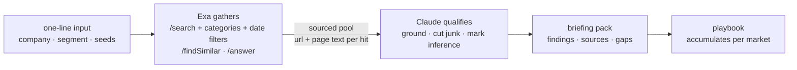

# field-agent

Field marketing runs on research: which city deserves the next event, who should be in the room, what the market is doing, what happens after. That research is most of the work and almost none of the craft. field-agent automates it on [Exa](https://exa.ai) search — one line in, one sourced markdown briefing pack out. Nothing ever sends.

**The proof run: [Exa's own competitive landscape, built on Exa's API](out/sample-competitors-exa.md).** One command produced the competitive set split direct/adjacent, dated moves with a "so what" each, a positioning read, and the gaps a human should close. Two rows from it:

> **Firecrawl ships a custom relevance model on `/search`, claims 94.7% SimpleQA and undercuts Exa/Tavily on price** — Jul 22, 2026. *So what:* the accuracy-vs-cost tradeoff that used to favour Exa on quality is being contested directly, on Exa's own turf — GTM should have a ready answer on why raw-index retrieval beats a paragraph-relevance model, not just an accuracy number.
>
> **Tavily acquired by Nebius, $275M initial** — Feb 10, 2026. *So what:* removes the most direct cloud-agnostic independent competitor as a standalone company, and narrows the "independent search API" positioning to Exa and a shrinking few.

More samples: [which market gets next quarter — London, Paris, Amsterdam or Munich](out/sample-market-emea.md), ranked with a pipeline rationale, format calls per local norms, and what would change the call. And [account expansion](out/sample-expand-emea.md) — two fintech seeds → Starling, Revolut, Swan, Aevi, tiered, with shrinking shells disqualified.

## Usage

```bash
python3 field_agent.py competitors "Acme (acme.com, payments infrastructure)"
python3 field_agent.py market "AI platform buyers" --cities London,Paris,Amsterdam,Munich
python3 field_agent.py expand accounts.txt --market EMEA
python3 field_agent.py brief "Jane Doe, Checkout.com"
python3 field_agent.py playbook london
```

## The commands

| Command | In | Out |
|---|---|---|
| `competitors` | a company or space | competitive set split direct/adjacent, dated recent moves with a "so what" each, positioning read, white space |
| `market` | a buyer segment + candidate cities | ranked memo: which market deserves the next quarter's investment, with a pipeline rationale and the evidence that would change the call |
| `expand` | seed accounts | tiered lookalike accounts via neural search + `findSimilar`, with region checks and disqualifications by name |
| `brief` | one person or company | pre-meeting dossier: live signals with sources, three specific openers, handle-with-care |
| `playbook` | a market's accumulated packs | the doc a next hire inherits instead of starting from zero: what we know, what worked, vendor notes, open questions, standing checklists |

## How it works



Two stages, every command. Exa gathers: `/search` with category and date filters, `/findSimilar` for lookalikes, `/answer` for cited questions. Claude qualifies: every claim grounded in source text, inference marked as inference, junk cut with reasons. Every pack ends with a gaps section — what the research could not establish and where a human digs next. When the research is bad, the pack says so instead of dressing up noise.

## Event add-ons

The same machinery pointed at field events, because research that never becomes a room is just reading:

| Command | What it does |
|---|---|
| `guests` | account-based seat map: target accounts in, who-sits-where and why-now out, with the notes a seller needs to turn the conversation into a next meeting ([sample](out/sample-guest-map-london.md)) |
| `dinner` | cold-start guest discovery for a new market, invites and run of show included — with the 4pm checks before a 6pm start ([sample](out/sample-brief-london.md)) |
| `venues` | private-dining shortlist with minimum-spend anchors cited in local currency and a walkthrough checklist ([sample](out/sample-venues-london.md)) |
| `followup` | post-event queue, drafts, CRM handoff notes, GDPR consent and lawful-basis notes |

## Setup

```bash
git clone https://github.com/b1rdmania/field-agent
cd field-agent
export EXA_API_KEY=your-key   # or put EXA_API_KEY=... in .env
python3 field_agent.py competitors "your company here"
```

Requires Python 3, curl, and the [Claude Code CLI](https://claude.com/claude-code) on PATH. No other dependencies — one file, stdlib only. A run costs a few cents of Exa credit and looks like this:

```text
$ python3 field_agent.py competitors "Exa (exa.ai, the search API for AI agents)"
field-agent competitors
  exa search: [peers] company competing directly with Exa
  exa search: [comparisons] Exa vs alternatives comparison
  exa search: [moves] Exa competitor funding round, product launch or partnership announcement
  exa answer: Who are Exa's main competitors and how do they differ?
  exa answer: What has changed in Exa's competitive market in the last six months?
  20 signals gathered, synthesising...
  wrote out/competitors-exa.md
```

## What it doesn't do

- Never contacts anyone — every pack is a brief for a human, not an outbound campaign
- Doesn't read your CRM; the gaps sections tell you what to check with the account owner instead
- Doesn't find email addresses, and isn't trying to

## Data handling

Research pulls public-source data with citations. Personal data stays out of version control: real run output is gitignored, committed samples are redacted to roles and companies. Follow-up packs include the lawful-basis note for contacting event attendees, and the consent checks sit next to the lists they apply to.

## Why this exists

I ran a global events programme for a technology company as the only hire: 35–40 activations a year across Europe, Asia and the US, reported as pipeline. The research load — who should be in the room, why now, what the market is doing, what happens after — is most of the job and almost none of the craft. This is that load, automated, so the person covering a continent spends their time on the part machines can't do: the room. — [Andy Bird](https://x.com/b1rdmania)

## License

MIT
