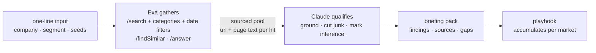

# field-agent

GTM research pipelines on [Exa](https://exa.ai) search: competitive landscapes, market focus, account expansion, target dossiers — and the playbook that accumulates what the research learns. Each command is one line in, one sourced markdown briefing pack out. Nothing ever sends.

```bash
python3 field_agent.py competitors "Acme (acme.com, payments infrastructure)"
python3 field_agent.py market "AI platform buyers" --cities London,Paris,Munich
python3 field_agent.py expand accounts.txt --market EMEA
python3 field_agent.py brief "Jane Doe, Checkout.com"
python3 field_agent.py playbook london
```

## Core pipelines

| Command | In | Out |
|---|---|---|
| `competitors` | a company or space | competitive set split direct/adjacent, dated recent moves with a "so what" each, positioning read, white space |
| `market` | a buyer segment + candidate cities | ranked memo: where to invest next quarter, with a pipeline rationale and what would change the call |
| `expand` | seed accounts | tiered lookalike accounts via neural search + `findSimilar`, with region checks and disqualifications by name |
| `brief` | one person or company | pre-meeting dossier: live signals with sources, three specific openers, handle-with-care |
| `playbook` | a market's accumulated packs | the inheritable doc: what we know, what worked, open questions, standing checklists |

The proof run: [Exa's own competitive landscape, built with Exa's API](out/sample-competitors-exa.md). It separates direct rivals from noise, dates the consequential moves (a competitor's acquisition, a rival's benchmark attack on price), reads positioning from the players' own launch posts, and flags which claims need primary sourcing before anyone repeats them. Other samples: [account expansion](out/sample-expand-emea.md) — two fintech seeds → Starling, Revolut, Swan, Aevi, tiered, with shrinking shells disqualified.

## Event add-ons

The same machinery pointed at field events, because research that never becomes a room is just reading:

| Command | What it does |
|---|---|
| `guests` | account-based seat map: target accounts in, who-sits-where and why-now out ([sample](out/sample-guest-map-london.md)) |
| `dinner` | cold-start guest discovery for a new market, invites and run of show included ([sample](out/sample-brief-london.md)) |
| `venues` | private-dining shortlist with cited minimum-spend anchors and a walkthrough checklist ([sample](out/sample-venues-london.md)) |
| `followup` | post-event queue, drafts, CRM handoff notes, lawful-basis note |

## How it works



Every command runs the same two stages. Exa gathers: `/search` with category and date filters for companies, people and fresh signals, `/findSimilar` for lookalikes, `/answer` for cited questions. Claude qualifies hard: every claim grounded in source text, inference marked as inference, junk cut with reasons. Every pack ends with a gaps section — what the research could not establish and where a human digs next. When the research is bad, the pack says so: the qualify stage returns an empty table with a diagnosis rather than a confident list of noise.

## Setup

```bash
git clone https://github.com/b1rdmania/field-agent
cd field-agent
export EXA_API_KEY=your-key   # or put EXA_API_KEY=... in .env
python3 field_agent.py competitors "your company here"
```

Requires Python 3, curl, and the [Claude Code CLI](https://claude.com/claude-code) on PATH. No other dependencies — one file, stdlib only. A run costs a few cents of Exa credit.

## What it doesn't do

- Never contacts anyone — every pack is a brief for a human, not an outbound campaign
- Doesn't read your CRM; the gaps sections tell you what to check with the account owner instead
- Doesn't find email addresses, and isn't trying to

## Data handling

Research pulls public-source data with citations. Personal data stays out of version control: real run output is gitignored, committed samples are redacted to roles and companies. Follow-up packs include the lawful-basis note for contacting event attendees, and the consent checks sit next to the lists they apply to.

## License

MIT
