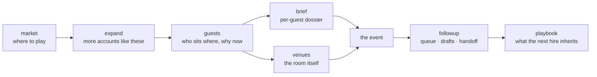

# field-agent

Exa is hiring a [Field Event Manager, EMEA](https://jobs.ashbyhq.com/exa). This repo is that job description, implemented on Exa's own API.

Eight commands covering the loop one person needs to run a region — market selection, account expansion, guest mapping, guest dossiers, venue sourcing, cold-start discovery, follow-through, and the playbook the next hire inherits. Each command is one line in, one markdown briefing pack out. Nothing ever sends.

| Command | The job spec says | What it does |
|---|---|---|
| `market` | "market prioritization … based on evidence" | ranks cities for a segment: buyer density, event landscape, local norms, verdict |
| `expand` | "target accounts" | sellers name seeds; neural search + `findSimilar` return tiered lookalikes with region checks |
| `guests` | "account-based events … invitation strategy" | account briefs with live AI signals, seat map, in-deal choreography per account |
| `brief` | "the right people in the room" | pre-event dossier on one guest: live signals, three openers, handle-with-care |
| `venues` | "venue, vendors, catering … negotiation" | private-dining shortlist, minimum-spend anchors with citations, walkthrough checklist |
| `dinner` | launching "from a near-blank page" | cold-start guest list, invites, run of show — when no account list exists yet |
| `followup` | "lead capture, timely handoff … consent" | prioritised queue, drafts, CRM handoff notes, lawful-basis note |
| `playbook` | "the documented approach future hires will inherit" | synthesises every pack for a market into the inheritable doc |

```bash
python3 field_agent.py market "AI platform buyers" --cities London,Paris,Munich
python3 field_agent.py expand accounts.txt --market EMEA
python3 field_agent.py guests accounts.txt --market London
python3 field_agent.py brief "Jane Doe, Checkout.com"
python3 field_agent.py venues London --seats 14
python3 field_agent.py followup attendees.txt --event "London infra dinner, 12 Aug"
python3 field_agent.py playbook london
```

Real runs, committed as samples: [guest map](out/sample-guest-map-london.md) (Revolut, Monzo, Checkout.com — one ML lead's own conference framing became the seating strategy) · [account expansion](out/sample-expand-emea.md) (two seeds → Starling, Revolut, Swan, Aevi, tiered, with shrinking shells disqualified by name) · [venue shortlist](out/sample-venues-london.md) (minimum-spend range cited, one venue's published price used as the negotiation anchor) · [cold-start dinner brief](out/sample-brief-london.md). Each run costs a few cents of Exa credit.

## How it works



Every command runs the same two stages. Exa gathers: `/search` with category and date filters for people, companies and fresh signals, `/findSimilar` for account lookalikes, `/answer` for cited market questions. Claude synthesises: qualifies hard, grounds every claim in the source text, and writes the pack. Every pack ends with a gaps section — what the research could not verify and what a human must check before anything moves. When the research is junk, the pack says so instead of laundering it: the qualify stage returns an empty table with reasons rather than a confident list of noise.

## Setup

```bash
git clone https://github.com/b1rdmania/field-agent
cd field-agent
export EXA_API_KEY=your-key   # or put EXA_API_KEY=... in .env
python3 field_agent.py venues London --seats 14
```

Requires Python 3, curl, and the [Claude Code CLI](https://claude.com/claude-code) on PATH. No other dependencies — one file, stdlib only.

## What it doesn't do

- Never contacts anyone — every pack is a brief for a human, not an outbound campaign
- Doesn't read your CRM; the gaps sections tell you what to check with the account owner instead
- Doesn't find email addresses, and isn't trying to

## Data handling

Research pulls public-source data with citations. Personal data stays out of version control: real run output is gitignored, committed samples are redacted to roles and companies. Follow-up packs include the lawful-basis note for contacting event attendees, and the consent checks sit next to the lists they apply to.

## License

MIT
